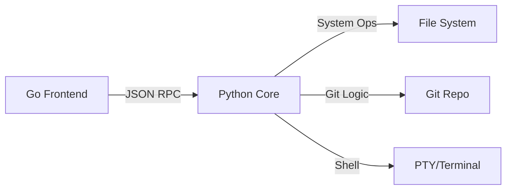

# 🟦 TRIX TUI-go

**Trix** is a modern, terminal-based IDE that combines the blazing performance of a **Go (Bubble Tea)** frontend with the extensive power of a **Python** logic backend. 

Designed for developers who live in the terminal, Trix offers a seamless, split-pane experience for file management, code editing, and real-time shell interaction—all connected via a high-performance JSON-RPC bridge.

---

## ✨ Features

- **🚀 Hybrid Architecture**: Go frontend for smooth UI rendering + Python backend for complex system logic.
- **📁 Integrated File Explorer**: Browse, open, and manage project structures with folder nesting support.
- **📝 Real-time Editor**: Full-featured text editor with unsaved changes tracking and multi-line support.
- **💻 Embedded Terminal**: Real PTY integration (via `winpty` on Windows) for a true shell experience.
- **🎨 Dynamic Themes**: Switch between high-contrast themes (Ayu Dark, Mirage, etc.) on the fly.
- **⚡ Zero-Config Bridge**: Automatic subprocess management and JSON communication out of the box.

---

## 🛠️ Tech Stack

- **Frontend**: [Bubble Tea](https://github.com/charmbracelet/bubbletea) & [Lip Gloss](https://github.com/charmbracelet/lipgloss) (Go)
- **Backend**: Python 3.x (with `pathlib` and `winpty`)
- **Communication**: JSON-RPC over Standard Streams

---

## ⌨️ Keyboard Shortcuts

| Shortcut | Action |
| :--- | :--- |
| `Ctrl + 1` | Focus File Explorer |
| `Ctrl + 2` | Focus Code Editor |
| `Ctrl + 3` | Focus Terminal |
| `Ctrl + O` | Open New Folder Overlay |
| `Ctrl + S` | Save Current File |
| `Ctrl + T` | Cycle Visual Themes |
| `Ctrl + Q` | Safe Quit |

---

## 🚀 Getting Started

### Prerequisites
- **Go**: 1.18 or higher
- **Python**: 3.8 or higher
- **Windows**: `pip install pywinpty` (for terminal support)

### Installation
1. Clone the repository:
   ```bash
   git clone https://github.com/yourusername/trix-tui-go.git
   cd trix-tui-go
   ```
2. Build the binary:
   ```bash
   go build -o trix.exe .
   ```

### Running
Simply execute the binary:
```bash
./trix.exe
```

---

## 🏗️ Architecture



---

## 📄 License
MIT License - Copyright (c) 2026 Trix Team
